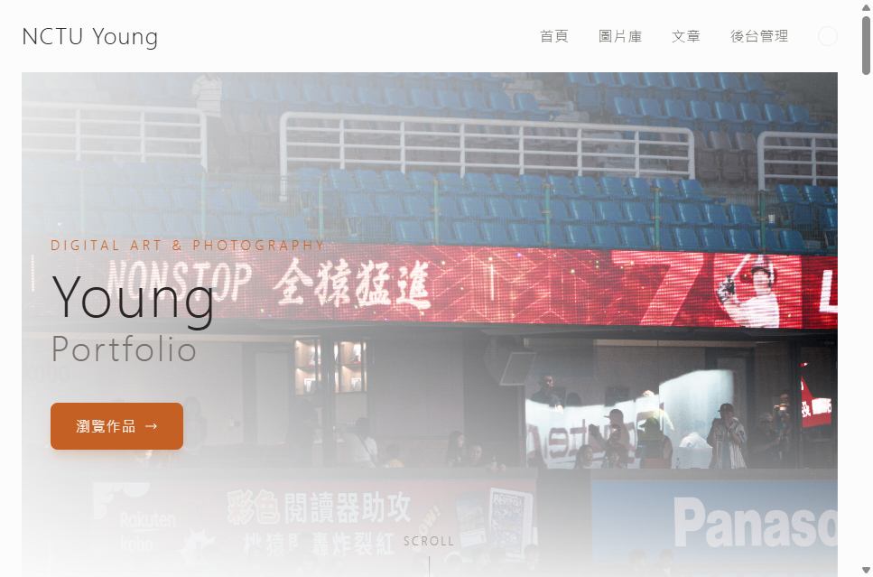
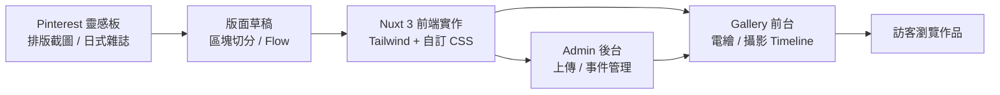
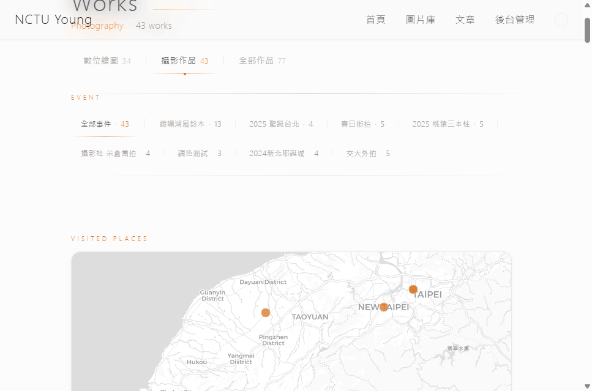
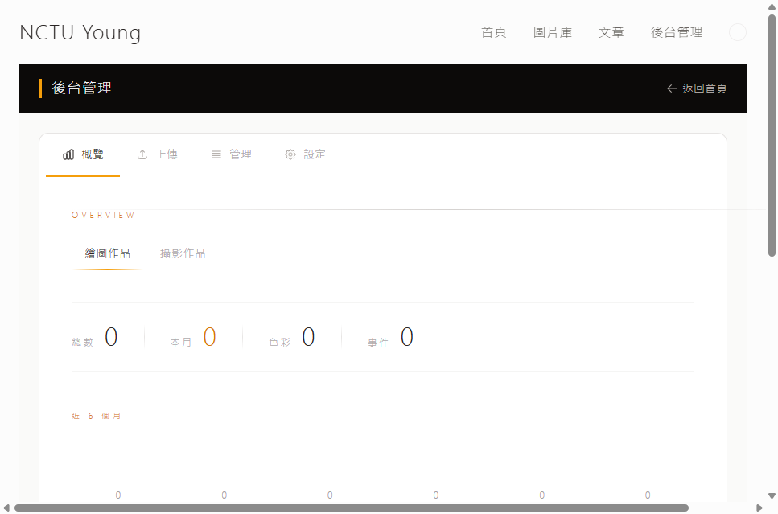

# Young Portfolio – 個人作品集網站

一個從 **Pinterest 排版靈感** 出發、漸漸長成的個人作品集網站。  
以 **日式排版感** 做為視覺主軸，整合「電繪作品」、「攝影事件時間軸」與「後台管理」成一個完整的工作流程。

---

## 專案概念（Concept）



- **靈感來源**：一開始只是從 Pinterest 收藏各種 editorial / Japanese layout 的排版截圖，想做一個「看起來像雜誌」的個人頁面。
- **視覺方向**：
  - 細線、豎排小字、留白和超大漢字，營造安靜的日式空氣感。
  - 攝影區塊用 Timeline 與事件分組，讓「一次外拍」在版面上有自己的故事節奏。
- **產品目標**：讓作者可以
  - 有儀式感地展示電繪與攝影作品
  - 在後台用事件管理上傳／整理素材
  - 長期維護一個「真的會更新」的作品集

### 概念圖：從靈感到作品集



---

## 功能特色

- **作品展示**
  - 支援電繪作品與攝影作品兩種主要類別
  - 攝影作品以「事件時間軸」＋摺疊卡片呈現
- **日式排版與動態**
  - 豎排小標、細線、留白、紙感陰影
  - Timeline 區塊有細緻的摺疊 / 展開過場動畫
- **攝影地圖（Photography Map）**
  - 只在「攝影」類別顯示
  - 使用 Leaflet + OpenStreetMap，將每個拍攝事件標在地圖上
  - Hover 顯示事件小卡與代表照片，點擊平滑捲動到下方該事件區塊


- **後台管理系統**
  - 上傳圖片、編輯事件、刪除作品
  - 自動讀取攝影 EXIF 資訊
  - 針對 Tab 切換與資料更新做過 UX 優化
- **靜態部署**
  - 支援 GitHub Pages 靜態部署
  - 前台與後台共用同一個 Nuxt 專案結構

---

## 線上網站

- **主網站**：[https://nctuyoung.github.io/young-portfolio/](https://nctuyoung.github.io/young-portfolio/)
- **後台管理**：[https://nctuyoung.github.io/young-portfolio/admin](https://nctuyoung.github.io/young-portfolio/admin)

---

## 專案結構（Overview）

```bash
├── components/
│   ├── admin/               # 後台管理組件
│   ├── EventMap.vue         # 攝影事件地圖
│   └── GalleryTimelineItem.vue
├── pages/
│   ├── index.vue            # 首頁（故事 + 精選作品）
│   ├── gallery.vue          # 作品集頁面（電繪 / 攝影）
│   └── admin.vue            # 後台入口
├── stores/                  # Pinia 狀態管理（gallery / admin / viewer）
├── server/api/              # 上傳 / 管理 API
├── public/
│   ├── images/              # 圖片檔案
│   ├── galleryList.json     # 電繪作品資料
│   └── photographyList.json # 攝影作品資料（含事件）
└── scripts/                 # 部署腳本
```

## 🛠️ 開發環境設置

### 安裝依賴

```bash
npm install
```

### 啟動開發伺服器

```bash
npm run dev
```

開發伺服器將在 `http://localhost:3000` 啟動

## 後台管理系統使用說明



後台管理系統提供四個主要功能頁面：

### 1. 概覽頁面
- 查看系統統計資訊
- 顯示最近上傳的作品
- 支援分類和檢視模式切換

### 2. 上傳頁面
- 支援拖拽上傳圖片
- 自動讀取 EXIF 資訊（攝影作品）
- 批量上傳和編輯功能
- 事件資訊設定

### 3. 管理頁面
- 按事件分組管理作品
- 圖片編輯和刪除功能
- 事件資訊編輯
- 支援網格和列表檢視

### 4. 設定頁面
- 系統偏好設定
- 圖片處理參數
- 介面語言和主題

### 使用流程

1. **上傳作品**
   - 進入「上傳」頁面
   - 選擇作品分類（繪圖/攝影）
   - 設定事件資訊
   - 拖拽或選擇圖片檔案
   - 編輯圖片標題和描述
   - 點擊「上傳圖片」

2. **管理作品**
   - 進入「管理」頁面
   - 選擇要管理的分類
   - 點擊「編輯模式」
   - 可以刪除圖片或編輯事件資訊

3. **查看統計**
   - 進入「概覽」頁面
   - 查看總圖片數、事件數等統計
   - 瀏覽最近上傳的作品

## 部署流程

### 自動部署到 GitHub Pages

```bash
npm run deploy
```

此命令會：
1. 建置靜態檔案
2. 建立 gh-pages 分支
3. 推送到 GitHub Pages

### 手動建置

```bash
# 建置生產版本
npm run build

# 預覽建置結果
npm run preview

# 生成靜態檔案（GitHub Pages）
npm run generate
```

## 技術棧

- **框架**：Nuxt 3
- **UI 框架**：Tailwind CSS
- **狀態管理**：Pinia
- **圖片處理**：EXIFR
- **檔案上傳**：Formidable
- **部署**：GitHub Pages

## 資料格式

### 繪圖作品 (galleryList.json)
```json
{
  "Img": [
    {
      "filename": "image.png",
      "title": "作品標題",
      "content": "作品描述",
      "color": "blue",
      "time": "2024-01-01"
    }
  ]
}
```

### 攝影作品 (photographyList.json)
```json
{
  "Img": [
    {
      "filename": "photo.jpg",
      "title": "照片標題",
      "content": "照片描述",
      "time": "2024-01-01",
      "camera": "相機型號",
      "lens": "鏡頭資訊",
      "settings": "拍攝設定",
      "event": {
        "name": "事件名稱",
        "description": "事件描述",
        "location": "拍攝地點"
      }
    }
  ]
}
```

## 貢獻指南

1. Fork 此專案
2. 建立功能分支 (`git checkout -b feature/AmazingFeature`)
3. 提交變更 (`git commit -m 'Add some AmazingFeature'`)
4. 推送到分支 (`git push origin feature/AmazingFeature`)
5. 開啟 Pull Request

## 授權

此專案採用 MIT 授權 - 詳見 [LICENSE](LICENSE) 檔案

## 聯絡資訊

- **作者**：Young
- **GitHub**：[NCTUyoung](https://github.com/NCTUyoung)
- **網站**：[https://nctuyoung.github.io/young-portfolio/](https://nctuyoung.github.io/young-portfolio/)

---

## 更新日誌

### v2.0.0 (2024-06-15)
- 全新後台管理系統
- Tab 導航設計（概覽、上傳、管理、設定）
- 大幅簡化巢狀結構
- 新增圖片編輯和刪除功能
- 事件管理功能
- 修復事件時間排序問題
- 統一設計語言和響應式佈局

### v1.0.0
- 基本作品集展示功能
- 響應式設計
- 圖庫和攝影作品分類
